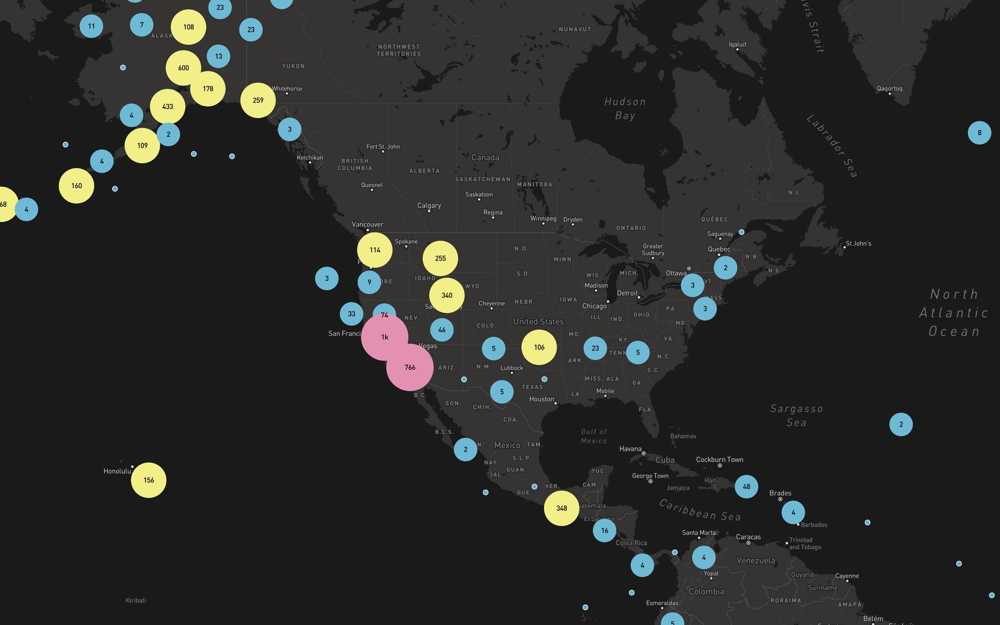
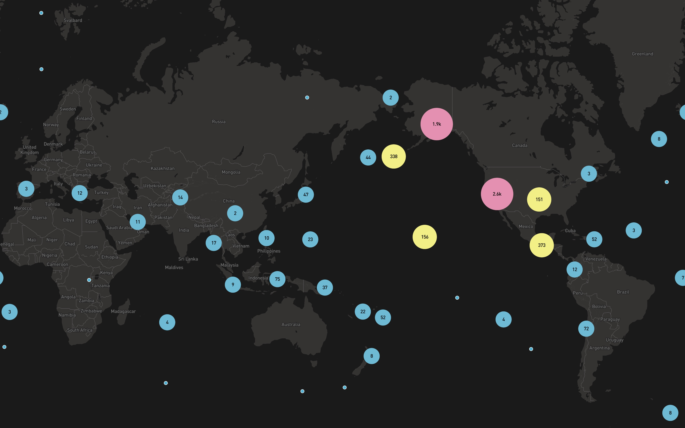

# application4
a clone of data visualisation from mapbox

## features
- [x] geojson data for visualizes all m1.0+ earthquakes from 12/22/15 to 1/21/16 as logged by usgs' earthquake hazards program

## demo
[https://saintsungminpark.github.io/application4](https://saintsungminpark.github.io/application4)

